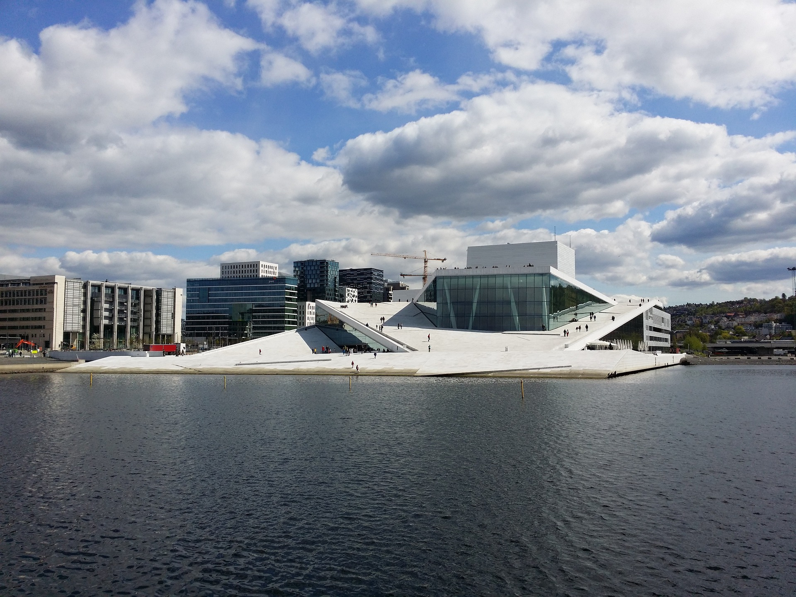

Предлог пројекта - Упознај свет
===============================

Мотивација
----------

Ево једног мало забавнијег начина да научиш ком округу припадају неки већи градови Србије. 

.. infonote::

    Циљ овог пројекта је да направиш програм, који кроз једноставну игру омогућава учење положаја градова у свету. Програм је довољно једноставан за употребу да може да буде интересантан и млађима, а повезан је са школским градивом па може да буде интересантан и старијима.

Сценарио пројекта
-----------------

Од играча се очекује да за задати град унесе државу у којој се тај град налази. Прилоком насумичног појављивања имена града играчу су понуђене и три државе. Једна од тих држава је тачан одговор на постављено питање.

Анализа и планирање
-------------------

Ресурси
'''''''

Потребно је да се одаберу градови и државе за које желите да се појаве у овој игрици. Ако нисте сигурни у своје знање, консултујте наставника географије или неки атлас света. Такође, ово је 
игрица која лако може да се преформулише и да се не погађају градови различитих држава у свету, већ се можете ограничити рецимо на Србију и погађати за дати град у ком се округу налази.

Код, променљиве 
''''''''''''''''

Један од начина да се напише код је следећи:

.. code::

    import random
    gradovi = [("Njujork", "Amerika", "Engleska", "Amerika", "Španija"), ("Beč", "Austrija", "Nemačka", "Austrija", "Australija"), ("Prag", "Češka", "Rusija", "Slovačka", "Češka")]
    k = random.randint(0,2)
    print("Kojoj drzavi pripada grad", gradovi[k][0], "? Ponuđene države su:", gradovi[k][2],",", gradovi[k][3], ",",gradovi[k][4])
    drzava = input()
    if drzava == gradovi[k][1] :
            print("Bravo! Dobiliste 1 poen!")
    else:
            print("Nije tacno! Probajte ponovo!")

Приказана листа се састоји од три елемента. Сваки елемент листе се састоји од пет елемената где први (на
позицији 0)
представља име града, затим име државе (на позицији 1) која је тачан одговор, па следе три имена држава (на
позицијама 2, 3 и 4)
која ће бити 
понуђена као одговори.

Овде је битно прокоментарисати да је у коду потребно додати много више држава него што смо ми ставили у листу. Игра ће бити много занимљивија ако је број држава већи. Такође, како је ово игра 
требало би да се води рачуна о променљивој која памти број освојених поена. Дакле, када играч погоди државу у којој се налази задати град, број поена би требало да се увећа за 1. На самом почетку,
док игра још није почела број поена мора бити постављен на нулу.

Ако желите да игра буде неизвесна, можете да уведете и негативне поене када играч да погрешан одговор.

Самоевалуација
--------------

Када направиш програм, покушај да (пре свега себи) одговориш на ова питања:

- Да ли је, по твојој процени, пројекат успешно приведен крају? Колико си ти лично задовољан-задовољна урађеним? Зашто?
- Који део је био посебно тежак? Како си га решио-решила? Да ли је постојао неки проблем чијим решавањем се посебно поносиш?
- Да ли је било накнадних измена првобитног плана? Због чега?
- Да ли је пројекат био користан за стицање или унапређивање неких знања или вештина? Којих?

Размисли шта од овога би било интересантно другима да чују током твог представљања пројекта. 

