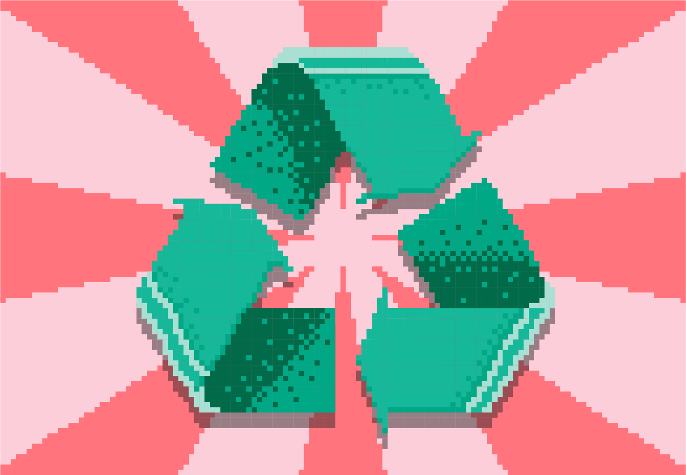

Предлог пројекта - Рециклажа
============================

Мотивација
----------

    
Ево једног пројекта којим желимо да подигнемо свест о значају рециклирања данас. Сви знамо да се изузетно брзо живи и да често користимо једнократну пластичну амбалажу. Такође знамо колико
та амбалажа загађује нашу животну средину, како бисмо још више подигли светс у вези са овим предлажемо да органиујете рециклирање лименки од газираног сока и пластичних флаша за воду на нивоу целе школе.
Како би одзив ученика био што већи ученици могу да се такмиче у броју сакупљених лименки и флашица. Једна лименка и једна флашица вреде исто, по један поен, али се за више донетих комада може направити
оваква игра:

- за мање од 3 рециклирана комада (свеједно је да ли лименка или флашица у питању) добије се 3 поена;

- за 3 и више од 3, а мање или једнако од 5 добије се 5 поена;

- за више од 5 комада добије се 10 поена.

.. infonote::

    Циљ овог пројекта је да направиш програм, који кроз једноставну игру омогућава праћење сакупљених поена на основу броја рециклираних комада лименки, односно флашица.

Сценарио пројекта
-----------------

Сваки ученик доноси амбалажу на рециклажу и на основу броја донетих артикала програм треба да израчуна колико је ученик добио поена у овој тури сакупљања празне амбалаже. Циљ је победити у овој игри,
односно сакупити највише амбалаже за рециклирање у својој школи.

Ученик када дође до места за предају амбалаже изброји колико је амбалаже донео и тада се уноси број. Ако ученик пре тога није доносио амбалажу, ученик се уписује у листу ученика који су до тада 
већ донели амбалажу за рециклирање. Уколико је ученик већ доносио амбалажу, на већ запамћени број поена за донету амбалажу, додају се поени за амбалажу која је управо донета. Сваком ученику се 
приликом прве предаје садржаја за рециклирање каже које име у листи му је додељено (ucenik1, ucenik2,..., ucenik15, ....) и ученик је дужан да запамти своје име. На крају 10 дана сакупљања или колико
дана већ траје акција проглашава се победник, број комада празне амбалаже које је победник сакупио, као и количина прикупљене амбалаже за рециклирање.

Анализа и планирање
-------------------

Ресурси
'''''''

За реализацију овог пројекта поразговаратје са својим наставницима, првенствено наставником биологије који вас може упутити детаљније у значај рециклаже у циљу очувања животне средине.
Напишите неки чланак, направите неки пано, посветите неки час овој теми. Покрените, заједно са својим наставницима, акцију рециклирања у својој школи.

Код, променљиве 
''''''''''''''''

Један од начина да се напише код је следећи:

.. code:: 

   ucenikk = 0
   n = int(input("Unesi broj komada ambalaže za reciklažu:"))
   if n < 3:
             ucenikk = ucenikk + 3
   else:
             if (n>=3) and (n <=5):
                          ucenikk = ucenikk + 5
             else:
                          ucenikk = ucenikk + 10 
   print(ucenikk)

Oбратити пажњу да ученика који први пут доноси материјал на рециклирање треба уписати (додати) у листу ученика који рециклирају амбалажу. Претходни код је написан тако као да се само броји први унос
к - тог ученика. Редефинисати постојећи код.

Самоевалуација
--------------

Када направиш програм, покушај да (пре свега себи) одговориш на ова питања:

- Да ли је, по твојој процени, пројекат успешно приведен крају? Колико си ти лично задовољан-задовољна урађеним? Зашто?
- Који део је био посебно тежак? Како си га решио-решила? Да ли је постојао неки проблем чијим решавањем се посебно поносиш?
- Да ли је било накнадних измена првобитног плана? Због чега?
- Да ли је пројекат био користан за стицање или унапређивање неких знања или вештина? Којих?

Размисли шта од овога би било интересантно другима да чују током твог представљања пројекта. 

