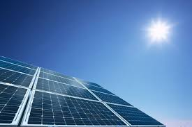

Предлог пројекта - Соларна електрана
====================================

Мотивација
----------

    
Овим пројектом желимо да подигнемо свест о значају еколошке производње енергије данас. Сви знамо да је на нашој планети 
све већа потреба за енергијом која покреће фабрике, греје наше домове, покреће возила итд. 

Да ли сте приметили соларну електрану (било велику или малу) у вашем окружењу?
Соларне електране претварају
енергију Сунца у електричну енергију и при томе не загађују животну средину. Могу се постављати на кровове кућа, великих
зграда као и на површину земље или чак воде. Спадају у обновљиве изворе енергије јер Сунце сија много дана у години, само је питање како то 
што нам свемир поклања да искористимо!

.. infonote::

    Главни циљ овог пројекта је да направиш програм, који омогућава унос максималне производње соларне електране у 
    киловатима
    (kW) и угла под којим Сунчеви зраци падају на плоче електране. Ако знамо да електана достиже свој пун капацитет 
    када зраци падају под углом од 90 степени, користити пропорцију за рачунање и испис на екран тренутне производње
    у киловатима (kW) и у процентима (%).

Сценарио пројекта
-----------------

Проналажењем информација на интернету ученици праве презентацију о обновљивим изворима енергије.
Проналазе  податке о броју сунчаних дана по месецима у Србији као и у неколико земаља по свом избору.
Упоређују прикупљене податке. 
Праве пано о значају обновљивих извора енергије и каче га на огласну таблу у школи.

Ученици праве програм који прерачунава тренутну производњу соларне електране у киловатима и процентуално.

Анализа и планирање
-------------------

Ресурси
'''''''
За прављење презентације потребан вам је рачунарски кабинет и интернет.
За реализацију овог пројекта поразговарајте са својим наставницима, првенствено наставником технике и технологије,
физике и математике који вас могу детаљније упутити. У значај производње чисте енергије може вас
упутити наставник биологије.
Напишите неки чланак, направите неки пано, посветите неки час овој теми. 

Код, променљиве 
''''''''''''''''

Један од начина да се напише код је следећи:

.. code:: 

   alfa = int(input("Pod kojim uglom suncev zrak pada na kolektor >> "))
   snaga = int(input("Kolika je snaga elektrane u kilovatima (kW) >> "))

   procenat = ???
   trenutna_snaga = ???

   print("Elektrana trenutno radi na " + ??? + "% kapaciteta i proizvodi " + ??? +"kW")

Можете допунити овај код на потребним местима, или можете писати свој програм из почетка.
За рачунање процента и тренутне снаге коју електрана производи било би лепо када бисте написали
функције које рачунају ове две вредности, то би ваш програм учинило да изгледа професионалније урађен. 
У том случају, писање једне функције би могао бити посао за једног члана пројектног тима,
а друге за другог док би остатак програма у коме би био и њихов позив рецимо био посао трећег члана.
Овакав рад на програму назива се модуларан рад и примењује се на пројектима у ИТ компанијама!

.. infonote::
    Ако вам се то учини компликовано можете потражити помоћ наставника,
    али потпуно је у реду и ако урадите рачунање без дефинисање и позива функција.

Потрудите се да ти резултати буду заокружени на целе бројеве. То ћете постићи тако што ћете
на интернету претражити *function round in python* а затим применити то што сте пронашли у вашем програму. 
За ову активност биће потребно мало знања из енглеског језика.
Претрага на интернету је такође веома 
важна и веома честа активност чланова пројектног тима на пројектима у ИТ компанијама.

.. infonote::
    Такође, ако вам се то учини компликовано можете потражити помоћ наставника,
    али потпуно је у реду и ако резултати буду релни бројеви на више децимала.

Самоевалуација
--------------

Када направиш програм, покушај да (пре свега себи) одговориш на ова питања:

- Да ли је, по твојој процени, пројекат успешно приведен крају? Колико си ти лично задовољан-задовољна урађеним? Зашто?
- Који део је био посебно тежак? Како си га решио-решила? Да ли је постојао неки проблем чијим решавањем се посебно поносиш?
- Да ли је било накнадних измена првобитног плана? Због чега?
- Да ли је пројекат био користан за стицање или унапређивање неких знања или вештина? Којих?

Размисли шта од овога би било интересантно другима да чују током твог представљања пројекта. 

