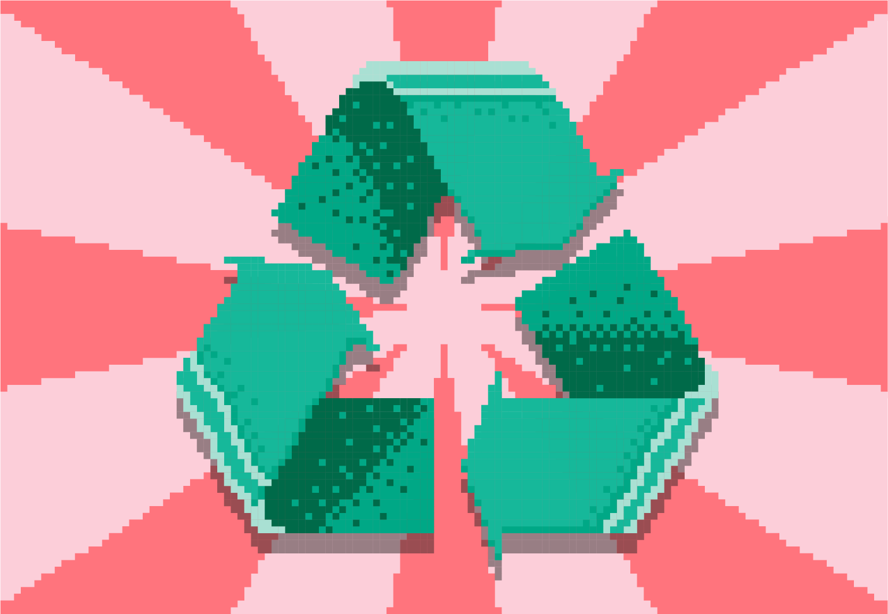

Предлог пројекта - Соларна електрана
============================

Мотивација
----------

    
Овим пројектом желимо да подигнемо свест о значају еколошке производње енергије данас. Сви знамо да је на нашој планети 
све већа потреба за електричном енергијом. Соларне електране претварају енергију Сунца у електричну енергију и при томе 
не загађују животну средину. Могу се постављати на кровове кућа, великих зграда као и на површину земље. Спадају у 
обновљиве изворе енергије.

.. infonote::

    Циљ овог пројекта је да направиш програм, који омогућава унос максималне производње соларне електране у киловатима
    (kW) и угла под којим Сунчеви зраци падају на плоче електране. Ако знамо да електана достиже свој пун капацитет 
    када зраци падају под углом од 90 степени, користити пропорцију за рачунање и испис на екран тренутне производње
    у киловатима и у процентима.

Сценарио пројекта
-----------------

Проналажењем информација на интернету ученици праве презентацију о обновљивим изворима енергије.
Проналазе  податке о броју сунчаних дана по месецима у Србији.
Упоређују годишњи број сунчаних дана са неколико земаља по свом избору. 
Праве пано о значају обновљивих извора енергије и каче га на огласну таблу у школи.

Ученици праве програм који прерачунава тренутну производњу соларне електране у киловатима и процентуално.

Анализа и планирање
-------------------

Ресурси
'''''''
За прављење презентације потребан вам је рачунарски кабинет и интернет.
За реализацију овог пројекта поразговарајте са својим наставницима, првенствено наставником технике и технологије,
физике и математике који вас могу детаљније упутити. У значај производње чисте енергије може вас
упутити наставник биологије.
Напишите неки чланак, направите неки пано, посветите неки час овој теми. 

Код, променљиве 
''''''''''''''''

Један од начина да се напише код је следећи:

.. code:: 

   ucenikk = 0
   n = int(input("Unesi broj komada ambalaže za reciklažu:"))
   if n < 3:
             ucenikk = ucenikk + 3
   else:
             if (n>=3) and (n <=5):
                          ucenikk = ucenikk + 5
             else:
                          ucenikk = ucenikk + 10 
   print(ucenikk)

Oбратити пажњу да ученика који први пут доноси материјал на рециклирање треба уписати (додати) у листу ученика који рециклирају амбалажу. Претходни код је написан тако као да се само броји први унос
к - тог ученика. Редефинисати постојећи код.

Самоевалуација
--------------

Када направиш програм, покушај да (пре свега себи) одговориш на ова питања:

- Да ли је, по твојој процени, пројекат успешно приведен крају? Колико си ти лично задовољан-задовољна урађеним? Зашто?
- Који део је био посебно тежак? Како си га решио-решила? Да ли је постојао неки проблем чијим решавањем се посебно поносиш?
- Да ли је било накнадних измена првобитног плана? Због чега?
- Да ли је пројекат био користан за стицање или унапређивање неких знања или вештина? Којих?

Размисли шта од овога би било интересантно другима да чују током твог представљања пројекта. 

